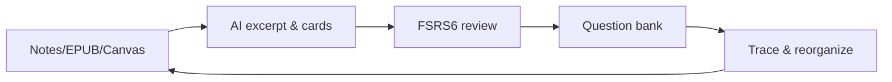

# Weave

[中文说明](README.md)

<div align="center">

**A full learning loop in Obsidian: excerpt → create cards → review → quiz**

</div>

Weave is a **learning workflow plugin** built for Obsidian. It turns reading notes and excerpts in your vault into standardized study cards you can review on a schedule, test with quizzes, and trace back to the original source.

Since **0.8.0**, the **EPUB reader** and **incremental reading** have been split into separate plugins maintained on their own. **This plugin** focuses on memory decks, question banks, smart card creation, and multi-source traceability.

> Minimum version: Obsidian **1.7.0** (desktop and mobile)

---

## Core problems we solve

| Pain point | How Weave helps |
|------------|-----------------|
| Lots of notes, little real retention | Create cards in-vault + **FSRS6 spaced repetition** |
| Memory cards mixed into source notes pollute structure | Cards live in a dedicated library; Markdown stays clean for reading |
| Cards disconnected from original context | Source anchors link back; jump, locate, and highlight in one click |
| Rote recall without real mastery checks | Memory decks + question banks for layered validation |
| Slow manual card creation | Built-in **AI assistant** and batch parsing (bring your own API) |
| Decks hard to reorganize | Reference-based, formal, and emergent deck layers |

---

## Multi-source traceability

### Separate storage, linked sources

Memory cards follow a **minimum-information** format (Q&A, cloze, multiple choice). That format is great for review but **not** for embedding in source notes: it disrupts how you read and think, and blurs “note content” vs “what to memorize.”

Weave uses **separate storage with trace links**:

- **Source documents**: Markdown, EPUB, and Canvas stay for reading, excerpting, and thinking—no need to rewrite notes for cards.
- **Study cards**: Excerpt notes and memory cards live in the dedicated `weave/` card library with their own scheduling.
- **Two-way traceability**: Cards store source anchors; “view source” jumps back and highlights context—**cards to source, source to cards**.

### Supported sources

All of the following support anchors and source navigation (**free**, no license gate):

| Source | Anchor style |
|--------|----------------|
| Obsidian Markdown | Block references, `^block-id` |
| EPUB reader (separate plugin) | CFI + excerpt anchors; cooperates with the main plugin |
| Canvas | Canvas path + node ID |

---

## Memory decks: two card types

Memory decks are the core of spaced repetition:

| Type | Stage | Role |
|------|-------|------|
| **Review excerpt notes** | Reading & comprehension | Keep passages and annotations; restore context when reviewing |
| **Recall memory cards** | Retrieval practice | Q&A, cloze, multiple choice; **FSRS6** schedules intervals |

Both types stay out of source documents. You can excerpt first, then promote to memory cards while keeping trace links. For objective checks, **question banks** (Premium) generate tests from memory cards.

> **Terms**
> - **Formal deck**: A focused set for a clear learning goal
> - **Emergent deck**: Surfaces themes that cluster in your knowledge network
> - **Reference-based deck**: Import and reorganize existing cards flexibly

---

## Standard workflow



1. **Input**: Excerpt from multiple sources; AI assistant and batch parsing optional  
2. **Organize**: Formal decks for goals; emergent decks for discovered themes  
3. **Remember**: Review excerpts in context + FSRS6 on memory cards  
4. **Test** (Premium): Quiz sessions for real mastery  
5. **Reflect**: Trace to source, fix notes, reorganize decks; optional AnkiConnect sync  

---

## Plugin ecosystem

| Plugin | Responsibility |
|--------|----------------|
| **Weave (main)** | Memory / question decks, smart cards, traceability, AI assistant, cross-plugin cooperation |
| **EPUB reader** | Immersive reading; card creation and source jump with the main plugin |
| **Incremental reading** | Reading queue and incremental scheduling |

---

## Free vs Premium

**Legend:** `✅` Free · `❌` Premium only · `⚠️` Degraded on Free

| Feature | Free | Premium | Notes |
|---------|:----:|:-------:|-------|
| Main UI, FSRS6, both card types | ✅ | ✅ | Core memory features stay free |
| Full traceability, view source | ✅ | ✅ | No restrictions |
| AI assistant, batch parsing, CSV import | ✅ | ✅ | You pay your own API costs |
| Table view | ✅ | ✅ | Full on Free |
| Grid / Kanban / Timeline | ⚠️ | ✅ | Free: basic view without filter/group/sort |
| Question bank, mock exams, deck analytics | ❌ | ✅ | Premium validation tools |
| Image occlusion, progressive cloze | ❌ | ✅ | Professional card types |

Premium requires an activation code (email binding). No ads, no forced subscription.

---

## Install & quick start

### Install

**Community plugins (recommended)**

Settings → Community plugins → turn off Restricted mode → search **Weave** → Install → Enable.

**Manual install**

Copy `main.js`, `manifest.json`, and `styles.css` to `.obsidian/plugins/weave/`, then restart Obsidian.

> Legacy APKG import also needs `sql-wasm.wasm`.

### Three steps to start

1. Open the Weave view from the sidebar and initialize the card library  
2. Optional: add an OpenAI-compatible API for AI card creation  
3. Excerpt from Markdown or EPUB, create memory cards, and start reviewing  

---

## Data storage

All learning data stays in your local vault (not uploaded by default):

| Data | Path | Format |
|------|------|--------|
| Memory decks | `weave/memory/` | `.wdeck` |
| Question banks | `weave/question-bank/` | `.qbank` |
| Plugin cache | `.obsidian/plugins/weave/` | Plugin config |

⚠️ Avoid bulk-renaming or deleting `.wdeck` / `.qbank` files unless you know the impact.

---

## Disclosure

- **Pricing:** Core memory review is free; quizzes, advanced views, and pro card types need Premium.  
- **Network:** AI uses your API; license checks use the official service; AnkiConnect is localhost only.  
- **Privacy:** Reads/writes local vault data only; no ads or product telemetry; no upload unless you use networked features.  

---

## License & support

Released under [GPL-3.0-or-later](LICENSE).

- **Issues & ideas:** [GitHub Issues](https://github.com/zhuzhige123/obsidian---Weave/issues)  
- **Licensing & business:** tutaoyuan8@outlook.com  

---

## Development

**Requirements:** Node.js 16+ and npm

```bash
npm install
npm run dev
npm run build
```
