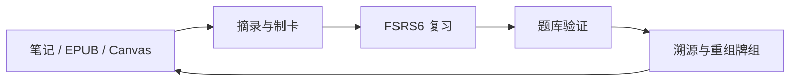
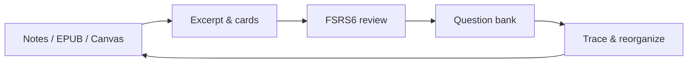

# Weave

[简体中文](README.zh-CN.md) | [中文](#中文文档) | [English](#english-documentation)


<div align="center">


**在 Obsidian 中完成「摘录 → 制卡 → 复习 → 测试」的学习闭环**

</div>

---

## 中文文档

### 插件介绍

如果你希望 **在 Obsidian 里不只记笔记，而是真的记住、并能验证自己掌握了什么**，可以试试 Weave。

它适合：把阅读摘录沉淀成复习卡片的人；需要 FSRS 间隔调度而不是凭感觉复习的人；想用题库检验理解、又不想把卡片塞进原始 Markdown 的人；以及希望从 Markdown、EPUB 或 Canvas **一键跳回原文语境** 的学习者。

最低 Obsidian 版本：**1.7.0**

### 核心能力

#### 学习闭环

- **摘录 → 制卡 → FSRS6 复习 → 测验验证 → 溯源重组**：卡片与源笔记分离存储，复习时仍可回到原文语境
- **全平台**：桌面端（Windows、macOS、Linux）与移动端（iOS、Android）

#### 牌组组织

- **正式牌组**：目标明确的学习集合（课程、考试范围、长期专题）
- **引用式牌组**：卡片可归属多个牌组，不绑定单一文件夹
- **涌现牌组**（高级）：按标签与规则自动聚合成可学习的主题观察面
- **记忆牌组等级**（高级）：掌握度驱动的等级与进度徽章

#### 卡片形态

- **问答、普通挖空、填空题、选择题**（单选 / 多选）
- **渐进式挖空**（高级）：按挖空序号递进掌握复杂知识点
- **图片遮罩**（高级）：在图片上绘制遮罩做图像挖空
- **回顾型摘录笔记** + **回忆型记忆卡片**：语境回顾与主动回忆分工

#### 制卡与互通

- **Obsidian 原生编辑**：用官方编辑器改卡，保留 Markdown / 公式 / 社区渲染扩展
- **从当前活动文档制卡**：关联正在编辑的笔记，沉淀带溯源的卡片
- **AI 助手与 AI 制卡**（自备 API）、解析预览导入、**CSV 导入**
- **批量解析**（高级）：文件夹映射、符号 / 正则解析与智能触发
- **APKG 导入 / 导出**：离线迁移 Anki 牌组，或将 Weave 牌组导出为 `.apkg`（非实时同步）
- **数据备份与恢复**：Vault 内备份槽与整库导出

#### 复习体验

- **FSRS6** 间隔调度（Again / Hard / Good / Easy）
- **撤销上一次评分**、**兄弟卡智能分散**（避免同源多卡扎堆）
- **查看原文**与**学习来源信息栏**：来源路径、材料上下文、同源卡片
- **多来源溯源**：Markdown 块引用、Canvas 节点、EPUB CFI（需阅读器插件）

#### 管理视图与笔记嵌入

- **表格视图**：筛选、排序与批量管理
- **网格 / 看板 / 时间线**（高级）：完整筛选、分组与排序
- **Markdown 牌组视图**（高级）：用 `weave-decks` 代码块把牌组视图嵌入笔记
- **关联当前活动文档**（高级）：侧边栏随当前笔记实时筛选相关卡片与测试题
- **关联卡片**（高级）：在卡片之间做同源 / 同笔记 / 关联网络筛选

#### 检验与分析

- **题库、模拟考试**（高级）：刷题与限时考试，补充「感觉记住了」的主观判断
- **文档测验**：从 Markdown 解析题目开考，并可写回统计
- **记忆率曲线**（基础）与**完整牌组分析**（高级：雷达、负荷预测、复习时机等）

#### 生态协同（可选）

| 插件 / 能力 | 作用 |
|-------------|------|
| [Weave EPUB Reader](https://github.com/zhuzhige123/obsidian-weave-reader) | 沉浸式阅读、摘录制卡、书籍锚点回跳 |
| 增量阅读（Weave 体系） | 阅读队列与章节排期 |
| PDF++、Excalidraw、Media Extended、Mind Map 等 | 把 PDF / 绘图 / 视频时间戳 / 脑图接入同一套复习闭环 |

未安装生态插件时，不影响 Markdown 制卡与 FSRS 复习主路径。

### 标准工作流



1. **输入**：从 Markdown、EPUB（需阅读器插件）或 Canvas 摘录，可选 AI 制卡
2. **组织**：正式牌组承载目标，涌现牌组承载主题聚类
3. **复习**：结合摘录语境与 FSRS6 记忆卡片
4. **验证**：用题库或文档测验检验掌握程度
5. **反思**：回溯来源、修正笔记、重组牌组

### 多来源溯源（要点）

记忆卡片采用**最小信息**格式，与源笔记**分离存储**，通过锚点保持关联：

- **源文档**继续负责阅读与思考（Markdown / EPUB / Canvas）
- **学习卡片**进入 `weave/` 卡片库（`.wdeck`、`.qbank`）
- **双向溯源**：从卡片查看原文，从材料回到相关卡片

### 基础体验与高级支持

对照以插件内激活提示为准：**基础体验永久可用**；**高级支持**为可选买断。

| 能力 | 基础体验 | 高级支持 |
|------|:--------:|:--------:|
| **全平台**（桌面端与移动端） | ✅ | ✅ |
| **FSRS6** 复习、摘录笔记与回忆型记忆卡片 | ✅ | ✅ |
| **问答 / 挖空 / 填空 / 选择题**；原生编辑、查看原文、学习来源栏 | ✅ | ✅ |
| **正式牌组**、引用式牌组、**表格视图** | ✅ | ✅ |
| **AI 助手 / AI 制卡**、解析预览导入、**CSV 导入**（API 费用自理） | ✅ | ✅ |
| **APKG 导入 / 导出**、数据备份 | ✅ | ✅ |
| **记忆率曲线** | ✅ | ✅ |
| **网格 / 看板 / 时间线**（完整筛选、分组、排序） | 🔒 | ✅ |
| **涌现牌组**、记忆牌组等级 | 🔒 | ✅ |
| **Markdown 牌组视图**（`weave-decks`）、关联当前活动文档、关联卡片 | 🔒 | ✅ |
| **渐进式挖空**、**图片遮罩** | 🔒 | ✅ |
| **批量解析** | 🔒 | ✅ |
| **题库**、模拟考试、**完整牌组分析** | 🔒 | ✅ |

> 图例：✅ 已包含 · 🔒 需启用高级支持

- **启用高级支持**：在插件设置中激活（邮箱绑定校验）；已激活 **Weave EPUB Reader** 高级支持时，可按产品规则继承授权。
- **买断制**：一次激活、长期使用（具体以仓库内许可条款为准），非强制订阅。

### 安装

#### 方式一：社区插件（推荐）

1. 打开 **设置 → 社区插件 → 浏览**（必要时关闭「限制模式」）
2. 搜索 **Weave**，安装并启用

#### 方式二：手动安装

1. 将 `main.js`、`manifest.json`、`styles.css` 复制到 `.obsidian/plugins/weave/`
2. 若需 **Legacy APKG 导入**，另附 `sql-wasm.wasm`
3. 重启 Obsidian 并启用插件

### 快速开始

1. 从侧边栏打开 Weave 视图，初始化卡片库（`weave/memory/` 等）
2. 可选：配置 OpenAI 兼容 API，用于 AI 制卡
3. 从 Markdown 或 EPUB 摘录，创建记忆卡片并开始复习
4. 可选：把卡片管理放到侧边栏，开启「关联当前活动文档」，边写笔记边看已沉淀的卡片

### 数据与同步

**建议同步（位于 Vault）**：`weave/memory/`（`.wdeck`）、`weave/question-bank/`（`.qbank`）、相关 Markdown 与附件。

**通常不需跨设备同步**：`.obsidian/plugins/weave/` 下的缓存与本地状态。多端学习请优先同步 Vault 内容。

⚠️ 除非你清楚影响，请勿批量重命名或删除 `.wdeck` / `.qbank` 文件。

### 隐私与网络

- 学习数据**默认保存在本地 Vault**，不会主动上传库内容。
- **高级支持激活**可能访问许可证服务，详见仓库隐私说明。
- **AI 功能**调用你自行配置的第三方 API；**APKG** 用于离线导入旧卡包 / 导出牌组，不依赖本机 Anki 常驻连接。

### 常见问题

#### 与 EPUB 阅读器、增量阅读的关系？

**Weave 可独立使用**：在 Markdown 中制卡、FSRS 复习、题库等不强制安装其它插件。安装 [Weave EPUB Reader](https://github.com/zhuzhige123/obsidian-weave-reader) 后，可在书中摘录、制卡并带书籍锚点跳回原文；增量阅读负责阅读队列与章节排期。阅读器高级支持可与 Weave 授权联动。三者**分工协作**，可按需安装。

#### 卡片与摘录能否全平台同步？

**支持。** 卡片库与相关笔记在 Vault 内，会随 Obsidian Sync、iCloud、网盘同步 Vault 等方式在桌面与移动端保持一致（见 [数据与同步](#数据与同步)）。

#### 是否支持导出 / 备份数据？

**支持。** 可将牌组导出为 **APKG**；`.wdeck`、`.qbank` 及关联 Markdown 均在库内，也可自行复制或通过插件数据管理备份。**数据完全本地化**，由你掌控备份策略。

#### 为何提供高级支持？

用于**支持持续开发**，让团队能长期投入、打磨复习与测验细节。**基础体验免费**，已覆盖 FSRS 复习、溯源、填空与选择题、AI 制卡（自备 API）、表格视图、APKG 互通等核心学习闭环；涌现牌组、完整视图、题库、批量解析、Markdown 嵌入等可按需启用高级支持。

#### 是订阅还是买断？

**买断制**（一次激活、长期使用），非按月订阅。

#### 各功能是否需高级支持？

见上文 [基础体验与高级支持](#基础体验与高级支持) 对照表。

### 更多文档

- 发布说明：`docs/RELEASE_GUIDE.md`
- 图片遮罩：`docs/IMAGE_MASK_GUIDE.md`
- 系列介绍：`docs/official-guide/weave-series-01-weave-intro.md`

### 许可证与作者

源码基于 [GPL-3.0-or-later](LICENSE) 发布。

- **Issues**：[GitHub Issues](https://github.com/zhuzhige123/obsidian---Weave/issues)
- **授权联系**：tutaoyuan8@outlook.com

### 开发

环境要求：Node.js 16+、npm

```bash
npm install
npm run dev
npm run build
```

---

## English Documentation

### Introduction

If you want **Obsidian to be more than a notebook—to actually remember and verify what you learned**—try Weave.

It fits learners who turn reading excerpts into review cards; who need FSRS spaced repetition instead of reviewing by feel; who want question banks to check understanding without stuffing cards into source Markdown; and who want **one-click jumps** back to context in Markdown, EPUB, or Canvas.

Minimum Obsidian version: **1.7.0**

### Core capabilities

#### Learning loop

- **Excerpt → cards → FSRS6 review → assessment → trace & reorganize**: cards are stored separately from source notes, with jumps back to original context
- **All platforms**: desktop (Windows, macOS, Linux) and mobile (iOS, Android)

#### Deck organization

- **Formal decks**: goal-oriented study sets (courses, exam scopes, long-term topics)
- **Reference-based decks**: cards can belong to multiple decks without folder lock-in
- **Emergent decks** (Premium): auto-cluster themes from tags and rules into learnable observation surfaces
- **Memory deck levels** (Premium): mastery-driven rank and progress badges

#### Card types

- **Q&A, cloze, fill-in-the-blank, multiple choice** (single / multi)
- **Progressive cloze** (Premium): master complex points step by step by cloze order
- **Image masks** (Premium): draw masks on images for occlusion practice
- **Review excerpts** + **recall cards**: context review vs active recall

#### Creation and interchange

- **Native Obsidian editing**: edit cards in the official editor (Markdown, math, community renderers)
- **Create cards from the active document**: keep source tracing while you write
- **AI assistant / AI card creation** (bring your own API), parse-preview import, **CSV import**
- **Batch parsing** (Premium): folder mapping, symbol / regex parsing, smart triggers
- **APKG import / export**: offline Anki migration, or export Weave decks as `.apkg` (not live sync)
- **Backup and restore**: vault backup slots and full-library export

#### Review experience

- **FSRS6** scheduling (Again / Hard / Good / Easy)
- **Undo last rating** and **sibling dispersion** (avoid clustering related cards)
- **View source** and **study source info**: paths, material context, related source cards
- **Multi-source tracing**: Markdown block refs, Canvas nodes, EPUB CFI (reader plugin required)

#### Views and note embeds

- **Table view**: filter, sort, and bulk manage
- **Grid / Kanban / Timeline** (Premium): full filter, group, and sort
- **Markdown deck views** (Premium): embed deck views with `weave-decks` code blocks
- **Filter by active document** (Premium): sidebar updates as you switch notes
- **Related cards** (Premium): filter same-source / same-note / related-card networks

#### Assessment and analytics

- **Question banks & mock exams** (Premium): objective checks beyond “I feel I remember”
- **Document quiz**: parse questions from Markdown, run a quiz, optionally write stats back
- **Retention curve** (Essential) and **full deck analytics** (Premium: radar, load forecast, timing, etc.)

#### Ecosystem (optional)

| Plugin / capability | Role |
|---------------------|------|
| [Weave EPUB Reader](https://github.com/zhuzhige123/obsidian-weave-reader) | Immersive reading, excerpts, book-anchor jumps |
| Incremental Reading (Weave family) | Reading queue and chapter scheduling |
| PDF++, Excalidraw, Media Extended, Mind Map, etc. | Bring PDFs, drawings, video timestamps, and mind maps into the same review loop |

Without ecosystem plugins, Markdown card creation and FSRS review still work.

### Standard workflow



1. **Input**: Excerpt from Markdown, EPUB (reader plugin), or Canvas; optional AI cards
2. **Organize**: Formal decks for goals; emergent decks for themes
3. **Review**: Excerpt context + FSRS6 recall cards
4. **Validate**: Question banks or document quizzes
5. **Reflect**: Trace to source, fix notes, reorganize decks

### Traceability (essentials)

Cards use a **minimum-information** format, **stored separately** from source notes, linked by anchors:

- **Source documents** stay for reading and thinking (Markdown / EPUB / Canvas)
- **Study cards** live under `weave/` (`.wdeck`, `.qbank`)
- **Two-way tracing** between cards and original context

### Essential experience and Premium support

Aligned with the in-plugin activation prompt: **Essential experience stays free**; **Premium support** is optional buy-once.

| Capability | Essential | Premium |
|------------|:---------:|:-------:|
| **All platforms** (desktop and mobile) | ✅ | ✅ |
| **FSRS6** review, excerpt notes and recall cards | ✅ | ✅ |
| **Q&A / cloze / fill-in / choice**; native editing, view source, study source info | ✅ | ✅ |
| **Formal decks**, reference-based decks, **table view** | ✅ | ✅ |
| **AI assistant / AI cards**, parse-preview import, **CSV import** (you pay API costs) | ✅ | ✅ |
| **APKG import / export**, data backup | ✅ | ✅ |
| **Retention curve** | ✅ | ✅ |
| **Grid / Kanban / Timeline** (full filter, group, sort) | 🔒 | ✅ |
| **Emergent decks**, memory deck levels | 🔒 | ✅ |
| **Markdown deck views** (`weave-decks`), active-document filter, related cards | 🔒 | ✅ |
| **Progressive cloze**, **image masks** | 🔒 | ✅ |
| **Batch parsing** | 🔒 | ✅ |
| **Question banks**, mock exams, **full deck analytics** | 🔒 | ✅ |

> Legend: ✅ included · 🔒 requires Premium support

- **Enable Premium support**: Activate in settings (email binding). EPUB Reader Premium may inherit per product rules.
- **Buy-once** licensing, not a forced subscription.

### Installation

#### Option 1: Community plugins (recommended)

1. **Settings → Community plugins → Browse** (disable Restricted mode if needed)
2. Search for **Weave**, install, and enable

#### Option 2: Manual installation

1. Copy `main.js`, `manifest.json`, and `styles.css` to `.obsidian/plugins/weave/`
2. Add `sql-wasm.wasm` if you need **Legacy APKG import**
3. Restart Obsidian and enable the plugin

### Quick start

1. Open the Weave view and initialize the card library under `weave/memory/`
2. Optional: configure an OpenAI-compatible API for AI card creation
3. Excerpt from Markdown or EPUB, create memory cards, and start reviewing
4. Optional: put card management in the sidebar and enable “filter by active document”

### Data and sync

**Sync in the vault**: `weave/memory/` (`.wdeck`), `weave/question-bank/` (`.qbank`), related Markdown and attachments.

**Usually local**: cache under `.obsidian/plugins/weave/`. Prefer syncing vault content across devices.

⚠️ Do not bulk-rename or delete `.wdeck` / `.qbank` files unless you understand the impact.

### Privacy and network

- Learning data stays **in your local vault** by default.
- **Premium support activation** may contact the license service.
- **AI** uses your API; **APKG** is for offline legacy import / deck export (no always-on Anki connection).

### FAQ

#### How does this relate to the EPUB reader and Incremental Reading?

**Weave works standalone** for Markdown cards, FSRS review, and question banks. With [Weave EPUB Reader](https://github.com/zhuzhige123/obsidian-weave-reader), you can excerpt in books and jump back via book anchors; Incremental Reading handles reading queues and chapter scheduling. Licensing may be shared per product rules. They are **complementary**, not hard dependencies.

#### Can cards and excerpts sync across platforms?

**Yes.** Decks and notes in the vault follow your Obsidian sync setup (see [Data and sync](#data-and-sync)).

#### Can I export or back up data?

**Yes.** Export decks as **APKG**; `.wdeck`, `.qbank`, and related files also live in the vault under your control. **Data is fully local** unless you use networked features you configure.

#### Why is Premium support paid?

It **funds ongoing development**. The **essential experience is free**—FSRS review, traceability, fill-in and choice cards, AI card creation (your API), table view, APKG interchange, and the core learning loop. Enable Premium when you need emergent decks, full views, question banks, batch parsing, Markdown embeds, and pro card types.

#### Subscription or buy-once?

**Buy-once** activation, not a monthly subscription.

#### Which features need Premium support?

See [Essential experience and Premium support](#essential-experience-and-premium-support) above.

### More documentation

- Release guide: `docs/RELEASE_GUIDE.md`
- Image masks: `docs/IMAGE_MASK_GUIDE.md`
- Series intro: `docs/official-guide/weave-series-01-weave-intro.md`

### License and author

Released under [GPL-3.0-or-later](LICENSE).

- **Issues**: [GitHub Issues](https://github.com/zhuzhige123/obsidian---Weave/issues)
- **Licensing**: tutaoyuan8@outlook.com

### Development

Requires Node.js 16+ and npm:

```bash
npm install
npm run dev
npm run build
```
