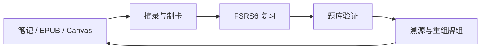
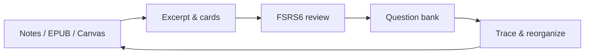

# Weave

[简体中文](README.zh-CN.md) | [中文](#中文文档) | [English](#english-documentation)

<div align="center">


**在 Obsidian 中完成「摘录 → 制卡 → 复习 → 测试」的学习闭环**

</div>

---

## 中文文档

### 插件介绍

如果你希望 **在 Obsidian 里不只记笔记，而是真的记住、并能验证自己掌握了什么**，可以试试 Weave。

它适合：把阅读摘录沉淀成复习卡片的人；需要 FSRS 间隔调度而不是凭感觉复习的人；想用题库检验理解、又不想把卡片塞进原始 Markdown 的人；以及希望从 Markdown、EPUB 或 Canvas **一键跳回原文语境** 的学习者。

自 **0.8.0** 起，**EPUB 阅读器**与**增量阅读**已拆为独立插件维护；**本插件**聚焦记忆牌组、题库、智能制卡与多来源溯源。可与 [Weave EPUB Reader](https://github.com/zhuzhige123/obsidian-weave-reader) 等插件协作，但不是硬性依赖。

## 核心能力

- **支持平台**：桌面端（Windows、macOS、Linux）与移动端（iOS、Android）
- **多来源溯源**：Markdown 块引用、EPUB 阅读器 CFI 锚点、Canvas 节点；卡片与原文双向跳转与高亮定位
- **记忆牌组与间隔复习**：回顾型摘录笔记 + 回忆型记忆卡片；**FSRS6** 调度复习节奏
- **智能制卡**：AI 助手与批量解析（自备 API）；问答、挖空、选择题等卡片形态
- **牌组组织**：正式牌组、涌现牌组、引用式牌组；表格视图管理卡片库
- **测验验证**：题库、模拟测试与牌组分析（见 [基础体验与高级支持](#基础体验与高级支持)）
- **其它**：网格 / 看板 / 时间线视图；渐进式挖空、图片遮罩；AnkiConnect；与 EPUB 阅读器、增量阅读插件的生态协作

各能力在 [基础体验与高级支持](#基础体验与高级支持) 中的划分见下表。

最低 Obsidian 版本：**1.7.0**


## 标准工作流



1. **输入**：从 Markdown、EPUB（需阅读器插件）或 Canvas 摘录，可选 AI 制卡  
2. **组织**：正式牌组承载目标，涌现牌组承载主题聚类  
3. **复习**：结合摘录语境与 FSRS6 记忆卡片  
4. **验证**：用题库检验掌握程度  
5. **反思**：回溯来源、修正笔记、重组牌组  


### 多来源溯源（要点）

记忆卡片采用**最小信息**格式，与源笔记**分离存储**，通过锚点保持关联：

- **源文档**继续负责阅读与思考（Markdown / EPUB / Canvas）  
- **学习卡片**进入 `weave/` 卡片库（`.wdeck`、`.qbank`）  
- **双向溯源**：从卡片查看原文，从材料回到相关卡片  

### 插件生态

| 插件 | 职责 |
|------|------|
| **Weave（本插件）** | 记忆牌组、题库、智能制卡、溯源、AI、跨插件协作 |
| [Weave EPUB Reader](https://github.com/zhuzhige123/obsidian-weave-reader) | 沉浸式阅读、摘录制卡、原文跳转 |
| 增量阅读（Weave 体系） | 阅读队列与章节排期 |

更完整说明见仓库内 `docs/` 与用户手册。

## 基础体验与高级支持

| 能力 | 基础体验 | 高级支持 |
|------|:--------:|:--------:|
| **全平台**（桌面端与移动端） | ✅ | ✅ |
| 主界面、**FSRS6** 复习、摘录笔记与回忆型记忆卡片 | ✅ | ✅ |
| **完整溯源**与查看原文 | ✅ | ✅ |
| **AI 助手**、批量解析、**CSV 导入**（API 费用自理） | ✅ | ✅ |
| **表格视图** | ✅ | ✅ |
| **网格 / 看板 / 时间线**（完整筛选、分组、排序） | 🔒 | ✅ |
| **题库**、模拟测试、**牌组分析** | 🔒 | ✅ |
| **渐进式挖空**、**图片遮罩** | 🔒 | ✅ |

> 图例：✅ 已包含 · 🔒 需启用高级支持（网格 / 看板 / 时间线在基础体验中提供简化版，完整能力需高级支持）

- **启用高级支持**：在插件设置中激活（邮箱绑定校验）；已激活 **Weave EPUB Reader** 高级支持时，可按产品规则继承授权。  
- **买断制**：一次激活、长期使用（具体以仓库内许可条款为准），非强制订阅。  

## 安装

### 方式一：社区插件（推荐）

1. 打开 **设置 → 社区插件 → 浏览**（必要时关闭「限制模式」）  
2. 搜索 **Weave**，安装并启用  

### 方式二：手动安装

1. 将 `main.js`、`manifest.json`、`styles.css` 复制到 `.obsidian/plugins/weave/`  
2. 若需 **Legacy APKG 导入**，另附 `sql-wasm.wasm`  
3. 重启 Obsidian 并启用插件  

## 快速开始

1. 从侧边栏打开 Weave 视图，初始化卡片库（`weave/memory/` 等）  
2. 可选：配置 OpenAI 兼容 API，用于 AI 制卡  
3. 从 Markdown 或 EPUB 摘录，创建记忆卡片并开始复习  

## 数据与同步

**建议同步（位于 Vault）**：`weave/memory/`（`.wdeck`）、`weave/question-bank/`（`.qbank`）、相关 Markdown 与附件。

**通常不需跨设备同步**：`.obsidian/plugins/weave/` 下的缓存与本地状态。多端学习请优先同步 Vault 内容。

⚠️ 除非你清楚影响，请勿批量重命名或删除 `.wdeck` / `.qbank` 文件。

## 隐私与网络

- 学习数据**默认保存在本地 Vault**，不会主动上传库内容。  
- **高级支持激活**可能访问许可证服务，详见仓库隐私说明。  
- **AI 功能**调用你自行配置的第三方 API；**AnkiConnect** 仅连接本地 Anki。  

## 常见问题

### 与 EPUB 阅读器的关系？

**Weave 可独立使用**：在 Markdown 中制卡、FSRS 复习、题库等不强制安装阅读器。安装 [Weave EPUB Reader](https://github.com/zhuzhige123/obsidian-weave-reader) 后，可在书中摘录、制卡并带书籍锚点跳回原文；阅读器高级支持可与 Weave 授权联动。二者**分工协作**，可按需安装。

### 卡片与摘录能否全平台同步？

**支持。** 卡片库与相关笔记在 Vault 内，会随 Obsidian Sync、iCloud、网盘同步 Vault 等方式在桌面与移动端保持一致（见 [数据与同步](#数据与同步)）。

### 是否支持导出 / 备份数据？

**支持。** `.wdeck`、`.qbank` 及关联 Markdown 均在库内，可自行复制、导出或通过 Obsidian 管理。**数据完全本地化**，由你掌控备份策略。

### 为何提供高级支持？

用于**支持持续开发**，让团队能长期投入、打磨复习与测验细节。**基础体验免费**，已覆盖 FSRS 复习、溯源、AI 制卡（自备 API）、表格视图等核心学习闭环，日常够用；题库、完整视图与分析等可按需启用高级支持。

### 是订阅还是买断？

**买断制**（一次激活、长期使用），非按月订阅。

### 各功能是否需高级支持？

见上文 [基础体验与高级支持](#基础体验与高级支持) 对照表。

## 更多文档

- 发布说明：`docs/RELEASE_GUIDE.md`  
- 图片遮罩：`docs/IMAGE_MASK_GUIDE.md`  

## 许可证与作者

源码基于 [GPL-3.0-or-later](LICENSE) 发布。

- **Issues**：[GitHub Issues](https://github.com/zhuzhige123/obsidian---Weave/issues)  
- **授权联系**：tutaoyuan8@outlook.com  

## 开发

环境要求：Node.js 16+、npm

```bash
npm install
npm run dev
npm run build
```

---

## English Documentation

### Introduction

If you want **Obsidian to be more than a notebook—to actually remember and verify what you learned**—Weave is built for that.

It fits learners who turn excerpts into review cards, want **FSRS scheduling** instead of ad-hoc cramming, need **question banks** without polluting source Markdown, and want **one-click jumps** back to context in Markdown, EPUB, or Canvas.

Since **0.8.0**, the **EPUB reader** and **incremental reading** are separate plugins. **This repo** focuses on memory decks, question banks, smart card creation, and multi-source traceability. It works with [Weave EPUB Reader](https://github.com/zhuzhige123/obsidian-weave-reader) but does not require it.

## Core capabilities

- **Platforms**: Desktop (Windows, macOS, Linux) and mobile (iOS, Android)
- **Multi-source traceability**: Markdown block refs, EPUB CFI anchors, Canvas nodes; two-way jumps and highlighting
- **Memory decks & spaced repetition**: Review excerpt notes + recall cards; **FSRS6** scheduling
- **Smart card creation**: AI assistant and batch parsing (bring your own API); Q&A, cloze, multiple choice
- **Deck organization**: Formal, emergent, and reference-based decks; table view for the card library
- **Assessment**: Question banks, mock exams, and deck analytics (see [Essential experience and Premium support](#essential-experience-and-premium-support))
- **More**: Grid / Kanban / Timeline views; progressive cloze and image masks; AnkiConnect; ecosystem plugins for EPUB reading and incremental reading

See [Essential experience and Premium support](#essential-experience-and-premium-support) for how capabilities are grouped.

Minimum Obsidian version: **1.7.0**


## Standard workflow



1. **Input**: Excerpt from Markdown, EPUB (reader plugin), or Canvas; optional AI cards  
2. **Organize**: Formal decks for goals; emergent decks for themes  
3. **Review**: Excerpt context + FSRS6 recall cards  
4. **Validate**: Question banks for mastery checks  
5. **Reflect**: Trace to source, fix notes, reorganize decks  


### Traceability (essentials)

Cards use a **minimum-information** format, **stored separately** from source notes, linked by anchors:

- **Source documents** stay for reading (Markdown / EPUB / Canvas)  
- **Study cards** live under `weave/` (`.wdeck`, `.qbank`)  
- **Two-way tracing** between cards and original context  

### Plugin ecosystem

| Plugin | Role |
|--------|------|
| **Weave (this plugin)** | Memory decks, question banks, smart cards, tracing, AI, cross-plugin APIs |
| [Weave EPUB Reader](https://github.com/zhuzhige123/obsidian-weave-reader) | Immersive reading, excerpts, source jumps |
| Incremental reading (Weave family) | Reading queue and chapter scheduling |

## Essential experience and Premium support

| Capability | Essential experience | Premium support |
|------------|:--------------------:|:---------------:|
| **All platforms** (desktop and mobile) | ✅ | ✅ |
| Main UI, **FSRS6** review, excerpt notes and recall cards | ✅ | ✅ |
| **Full traceability** and view source | ✅ | ✅ |
| **AI assistant**, batch parsing, **CSV import** (you pay API costs) | ✅ | ✅ |
| **Table view** | ✅ | ✅ |
| **Grid / Kanban / Timeline** (full filter, group, sort) | 🔒 | ✅ |
| **Question banks**, mock exams, **deck analytics** | 🔒 | ✅ |
| **Progressive cloze**, **image masks** | 🔒 | ✅ |

> Legend: ✅ included · 🔒 requires Premium support (Grid / Kanban / Timeline have a simplified essential tier; full power needs Premium support)

- **Enable Premium support**: Activate in settings (email binding). EPUB Reader Premium may inherit per product rules.  
- **Buy-once** licensing, not a forced subscription.  

## Installation

### Option 1: Community plugins (recommended)

1. **Settings → Community plugins → Browse** (disable Restricted mode if needed)  
2. Search for **Weave**, install, and enable  

### Option 2: Manual installation

1. Copy `main.js`, `manifest.json`, and `styles.css` to `.obsidian/plugins/weave/`  
2. Add `sql-wasm.wasm` if you need **Legacy APKG import**  
3. Restart Obsidian and enable the plugin  

## Quick start

1. Open the Weave view and initialize the card library under `weave/memory/`  
2. Optional: configure an OpenAI-compatible API for AI card creation  
3. Excerpt from Markdown or EPUB, create memory cards, and start reviewing  

## Data and sync

**Sync in the vault**: `weave/memory/` (`.wdeck`), `weave/question-bank/` (`.qbank`), related Markdown and attachments.

**Usually local**: cache under `.obsidian/plugins/weave/`. Prefer syncing vault content across devices.

⚠️ Do not bulk-rename or delete `.wdeck` / `.qbank` files unless you understand the impact.

## Privacy and network

- Learning data stays **in your local vault** by default.  
- **Premium support activation** may contact the license service.  
- **AI** uses your API; **AnkiConnect** is localhost only.  

## FAQ

### How does this relate to the EPUB reader?

**Weave works standalone** for Markdown cards, FSRS review, and question banks. With [Weave EPUB Reader](https://github.com/zhuzhige123/obsidian-weave-reader), you can excerpt in books, create cards with book anchors, and jump back to passages; licensing may be shared per product rules. They are **complementary**, not a hard dependency.

### Can cards and excerpts sync across platforms?

**Yes.** Decks and notes in the vault follow your Obsidian sync setup (see [Data and sync](#data-and-sync)).

### Can I export or back up data?

**Yes.** `.wdeck`, `.qbank`, and related files live in the vault under your control. **Data is fully local** unless you use networked features you configure.

### Why is Premium support paid?

It **funds ongoing development**. The **essential experience is free**—FSRS review, traceability, AI card creation (your API), table view, and the core learning loop. Enable Premium support when you need question banks, full views, analytics, and pro card types.

### Subscription or buy-once?

**Buy-once** activation, not a monthly subscription.

### Which features need Premium support?

See [Essential experience and Premium support](#essential-experience-and-premium-support) above.

## More documentation

- Release guide: `docs/RELEASE_GUIDE.md`  
- Image masks: `docs/IMAGE_MASK_GUIDE.md`  

## License and author

Released under [GPL-3.0-or-later](LICENSE).

- **Issues**: [GitHub Issues](https://github.com/zhuzhige123/obsidian---Weave/issues)  
- **Licensing**: tutaoyuan8@outlook.com  

## Development

Requires Node.js 16+ and npm:

```bash
npm install
npm run dev
npm run build
```
