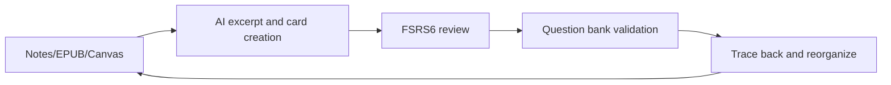

# Weave

Language: English | [简体中文](README.zh-CN.md)

<div align="center">

**A full learning loop in Obsidian: excerpt -> create cards -> review -> quiz**

</div>

Weave is a learning workflow plugin for Obsidian. It turns reading notes and excerpts in your vault into structured study cards that you can review on a schedule, test with quizzes, and trace back to the original source.

Since `0.8.0`, the EPUB reader and incremental reading directions have been split into separate plugins. The main Weave plugin now focuses on memory decks, question banks, smart card creation, and multi-source traceability.

Minimum supported version: Obsidian `1.7.0`

---

## Core Problems We Solve

| Pain point | How Weave helps |
|------------|-----------------|
| Lots of notes, little real retention | In-vault card creation with **FSRS6 spaced repetition** |
| Memory cards mixed into source notes pollute structure | Cards live in a dedicated library while source Markdown stays clean |
| Cards lose their original context | Source anchors let cards jump back, locate, and highlight the original passage |
| Rote recall without real mastery checks | Memory decks and question banks support layered learning and validation |
| Manual card creation is slow | Built-in AI assistant and batch parsing workflows |
| Decks become hard to reorganize | Reference-based, formal, and emergent deck organization |

---


## Multi-Source Traceability

### Separate storage, linked sources

Memory cards use a minimum-information format such as Q&A, cloze, and multiple choice. That format is effective for review, but it is not ideal to embed directly into source notes because it disrupts note structure and mixes reading content with memorization content.

Weave uses separate storage with trace links:

- **Source documents**: Markdown, EPUB, and Canvas remain reading and thinking spaces.
- **Study cards**: excerpt notes and memory cards live in the dedicated `weave/` card library.
- **Two-way traceability**: cards store source anchors so you can jump back to context, and source material can stay connected to cards.

### Supported source types

| Source | Anchor style |
|--------|--------------|
| Obsidian Markdown | Block references and `^block-id` |
| EPUB reader plugin | CFI plus excerpt anchors |
| Canvas | Canvas path plus node ID |

---

## Memory Decks: Two Card Types

Memory decks are the core of spaced repetition in Weave:

| Type | Stage | Role |
|------|-------|------|
| Review excerpt notes | Reading and comprehension | Preserve passages and annotations so review restores the original context |
| Recall memory cards | Retrieval practice | Q&A, cloze, and multiple choice cards scheduled by **FSRS6** |

Both card types stay out of source documents. You can excerpt first, then promote to memory cards while keeping traceability. For objective checks, question banks can generate tests from memory cards.

### Deck concepts

- **Formal deck**: a focused deck built for a clear learning target
- **Emergent deck**: a deck formed from patterns that surface across your knowledge network
- **Reference-based deck**: a flexible way to reorganize existing cards without forcing one fixed ownership path

---

## Standard Workflow



1. **Input**: excerpt from Markdown, EPUB, or other supported sources
2. **Organize**: build formal decks for goals and emergent decks for discovered themes
3. **Review**: use excerpt context and FSRS6 memory cards together
4. **Validate**: run question-bank sessions to check real understanding
5. **Reflect**: trace back to the source, refine notes, and reorganize decks

---

## Plugin Ecosystem

| Plugin | Responsibility |
|--------|----------------|
| **Weave main plugin** | Memory decks, question banks, smart cards, traceability, AI assistant, and cross-plugin cooperation |
| **EPUB reader plugin** | Dedicated EPUB reading with excerpt creation and source jumping |
| **Incremental reading plugin** | Reading queue management and incremental scheduling |

---

## Free vs Premium

Legend:

- `Available on Free`
- `Premium only`
- `Limited on Free`

| Feature | Free | Premium | Notes |
|---------|------|---------|-------|
| Main UI, FSRS6 review, and both card types | Available | Available | Core memory workflow stays free |
| Full traceability and view source | Available | Available | No license gate |
| AI assistant, batch parsing, CSV import | Available | Available | User-provided API costs are separate |
| Table view | Available | Available | Full base management view |
| Grid, Kanban, Timeline | Limited | Available | Free version keeps only the fallback experience |
| Question bank, mock exams, deck analytics | Premium only | Available | Validation and analytics features |
| Image occlusion and progressive cloze | Premium only | Available | Advanced study card types |

Premium activation uses an activation code and email binding. The plugin does not use ads or forced subscriptions.

---

## Installation

Most users only need these three files:

- `main.js`
- `manifest.json`
- `styles.css`

If you need `Legacy APKG import`, also include `sql-wasm.wasm`.

### Community plugins

1. Open Obsidian Settings
2. Go to Community plugins
3. Turn off Restricted mode
4. Search for `Weave`
5. Install and enable

### Manual installation

1. Download:
   - `main.js`
   - `manifest.json`
   - `styles.css`
2. If needed for `Legacy APKG import`, also download:
   - `sql-wasm.wasm`
3. Copy the files into:

   `.obsidian/plugins/weave/`

4. Restart Obsidian and enable the plugin

Notes:

- Community-store installation relies on the three core files above.
- `versions.json` is repository compatibility metadata, not a required runtime asset for community installation.

---

## Quick Start

1. Open the Weave view
2. Configure settings such as data paths, deck behavior, and optional integrations
3. Excerpt from Markdown or EPUB, create memory cards, and begin review

---

## Data Storage

Learning data stays in your local vault by default:

| Data | Path | Format |
|------|------|--------|
| Memory deck data | `weave/memory/` | `.wdeck` |
| Question-bank data | `weave/question-bank/` | `.qbank` |
| Plugin-local state, cache, and logs | `.obsidian/plugins/weave/` | Plugin-managed files |

Please avoid bulk-renaming or manually deleting `.wdeck` and `.qbank` files unless you understand the impact.

---

## Disclosures

### Pricing

- Core memory and review features are available for free.
- Some advanced features require a valid paid activation code.
- Premium activation uses an email address for license binding and validation.

### Network use

- **AI assistant** connects only to user-configured AI API endpoints.
- **License activation and validation** connect to the plugin license service.
- **AnkiConnect** connects only to the local Anki instance through `localhost`.

### File access

- The plugin reads and writes Markdown files, attachments, card data, and learning state inside the current vault.
- Plugin-local cache, runtime state, backups, and logs are stored under `.obsidian/plugins/weave/`.
- Vault content is not uploaded to external services unless the user explicitly uses a networked feature.

### Vault enumeration and scanning

- Some features enumerate Markdown files or vault files through the Obsidian API, including suggestion dialogs, source tracing, cleanup tools, duplicate detection, and batch parsing flows.
- These scans stay inside the local vault unless the user explicitly invokes a separate networked feature.

### Clipboard access

- Clipboard read or write is used only for user-invoked actions such as copy buttons, source-copy helpers, activation-code copy, prompt copy, or paste/import workflows.
- The plugin does not continuously monitor the system clipboard in the background.

### Local state storage

- Weave primarily stores managed local state under `.obsidian/plugins/weave/`.
- Some legacy browser `localStorage` keys may still be read during compatibility migration or fallback handling.

### Ads, telemetry, and source code

- The plugin does not include ads.
- The plugin does not include product analytics telemetry.
- This repository contains the client source code used for review and release. Private keys and server-side secrets are not shipped here.

---

## License And Support

This project is released under [GPL-3.0-or-later](LICENSE).

- Issues and feature requests: https://github.com/zhuzhige123/obsidian---Weave/issues
- Licensing or business contact: tutaoyuan8@outlook.com

---

## Development

Requirements: Node.js 16+ and npm

```bash
npm install
npm run dev
npm run build
```

---

## More Documentation

- Release guide: `docs/RELEASE_GUIDE.md`
- Image masking guide: `docs/IMAGE_MASK_GUIDE.md`
