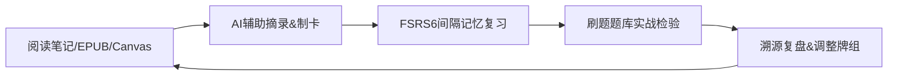

# Weave

[English](README.en.md)

Chinese documentation: [README.zh-CN.md](README.zh-CN.md)

<div align="center">

<<<<<<< HEAD
**在 Obsidian 内完成「摘录 → 制卡 → 复习 → 刷题测试」全链路学习闭环**

</div>

Weave 是专为 Obsidian 打造的**学习工作流插件**，可在同一知识库中将阅读笔记、摘录内容转化为可间隔复习、可刷题检验、可溯源原文的标准化学习卡片。

自 `0.8.0` 版本起，**EPUB 阅读器**与**增量阅读**已拆分为独立插件并单独维护；本插件聚焦记忆牌组、刷题题库、智能制卡与多源文档溯源协作。

> 最低兼容版本：Obsidian **1.7.0**（支持桌面端 / 移动端）

---

## 解决核心痛点

| 用户痛点 | Weave 解决方案 |
|----------|----------------|
| 笔记存量大、真正记忆掌握少 | 知识库内独立制卡 + **FSRS6 智能间隔复习** |
| 记忆卡片混入原文，污染笔记结构 | 卡片独立存入专属库，源 Markdown 保持纯阅读笔记本色 |
| 记忆卡片与原文上下文脱节 | 溯源锚点绑定源文档，一键跳转定位并高亮原文 |
| 仅机械记忆，无法实战检验掌握程度 | 区分记忆牌组 + 刷题题库，分层学习验收 |
| 手动制卡耗时低效 | 内置 AI 智能制卡助手，支持批量解析（用户自备 API） |
| 牌组杂乱难以重组管理 | 引入式牌组、正式攻坚牌组、涌现主题牌组分层管理 |

---

## 全来源溯源设计

### 源文档与学习卡片分离架构

记忆卡片遵循**最小信息提取原则**，问答、挖空、选择题等卡片格式适合复习，但不适合嵌入原生笔记：既打乱原文思考结构，又容易混淆阅读内容与背诵内容。

Weave 采用**分离存储、关联溯源**设计：

- **源文档**：Markdown / EPUB / Canvas 仅负责阅读、摘录、自由思考，无需为制卡修改原文结构。
- **学习卡片**：摘录笔记、记忆卡片统一存放于 `weave/` 专属卡片库，独立管理调度。
- **双向溯源**：卡片绑定原文锚点，一键跳转定位、高亮上下文，实现「卡片看原文、原文查卡片」。

### 支持溯源的文档来源

所有来源生成的卡片均支持锚点定位、原文跳转（免费版全开放）：

| 文档来源 | 锚点定位方式 |
|----------|--------------|
| Obsidian Markdown | 块引用、`^block-id` 块标识 |
| EPUB 阅读器（独立插件） | CFI 章节定位 + 摘录锚点，与主插件无缝协作 |
| Canvas 画布 | 画布路径 + 节点唯一 ID 精准定位 |

---

## 记忆牌组：双类型卡片体系

记忆牌组是间隔重复学习核心，承载两类差异化笔记能力：

| 卡片类型 | 学习阶段 | 核心作用 |
|----------|----------|----------|
| 回顾摘录笔记 | 阅读理解阶段 | 留存原文片段 + 个人批注，复习时还原知识语境 |
| 回忆记忆卡片 | 记忆提取阶段 | 支持问答 / 挖空 / 选择题型，由 FSRS6 智能分配复习间隔 |

两类卡片独立存储、不污染源文档，支持同源递进创作（先摘录、再提炼为记忆卡），全程保留溯源关联；进阶可通过刷题题库生成测试题，客观检验掌握程度。

> **名词释义**
> - **正式牌组**：定向攻坚目标知识点，系统化背诵
> - **涌现牌组**：自动聚合零散笔记，发现隐藏知识主题
> - **引入式牌组**：灵活导入重组已有卡片，自定义学习计划

---

## 标准学习工作流



1. **内容输入**：多源文档摘录，支持 AI 助手一键制卡、批量解析  
2. **牌组组织**：正式牌组定学习目标，涌现牌组挖掘知识关联  
3. **间隔记忆**：摘录语境回顾 + 记忆卡片 FSRS6 智能复习  
4. **实战检验**（高级版）：开启刷题会话，检验真实掌握程度  
5. **复盘迭代**：溯源回到原文修正笔记、重组牌组；支持 AnkiConnect 联动同步  

---

## 插件生态分工

| 插件产品 | 核心职责分工 |
|----------|--------------|
| **Weave 主插件** | 记忆 / 刷题牌组、智能制卡、全源溯源、AI 助手、跨插件协作 |
| **EPUB 阅读器插件** | 独立沉浸式 EPUB 阅读，与主插件联动实现摘录制卡、原文跳转 |
| **增量阅读插件** | 阅读内容队列管理、增量阅读进度智能调度 |

---

## 功能版本权限划分
=======


</div>

Weave is a learning workflow plugin for Obsidian focused on turning notes, memory cards, and quiz practice into one traceable and reviewable study loop.

The main plugin currently focuses on two core capability groups:

- Memory decks: subjective memorization and review scheduling based on FSRS6
- Question decks: generate quizzes from memory cards and track objective performance, including EWMA-based trend tracking

Cards, quiz items, and source references created in Weave remain linkable through block references and backlinks, so you can trace where knowledge came from and review it in context.

Minimum supported Obsidian version: 1.7.0

## Who It Is For

- People who want a full “note -> card -> review -> test” loop inside Obsidian
- People who want cards and questions to stay connected to their source notes
- People who want to sync cards with local Anki through AnkiConnect

## Core Capabilities

- Memory card study with FSRS6-based scheduling
- Question-bank and quiz workflows generated from memory cards
- Reference-based deck architecture that allows flexible deck reuse and reorganization
- Card management views including table, grid, and kanban
- Source tracing from cards or quiz items back to the original context
- AnkiConnect integration for local Anki interoperability

## About The Separate Incremental Reading Plugin

Starting after `0.8.0`, **incremental reading has been progressively split into a separate Obsidian plugin direction**.  
This README now describes the main Weave plugin only and no longer presents incremental reading as a core capability of the main plugin.

## Free vs Premium

Legend:
- `✅` available
- `❌` not included
- `⚠️` limited or fallback experience in the free version

At a glance:
- The free version already covers the main view, memory-card study, FSRS6 review, base deck study, table management, and source tracing for the core learning loop.
- Premium mainly expands the experience with question-bank workflows, deck analytics, advanced views, batch parsing, progressive cloze, image occlusion, and AI-assisted features.

| Feature | Free | Premium | Notes |
|---|---|---|---|
| Weave main view and core navigation | ✅ | ✅ | Primary plugin entry |
| Memory card study and FSRS6 review scheduling | ✅ | ✅ | Core learning capability |
| Deck study workflow | ✅ | ✅ | Base study flow |
| Table view | ✅ | ✅ | Default management view |
| View source / open source context | ✅ | ✅ | Fully free with no restrictions |
| Grid view | ⚠️ | ✅ | Free users fall back to table view with an activation prompt |
| Timeline view | ⚠️ | ✅ | Free users stay on the regular grid layout with an activation prompt |
| Kanban view | ⚠️ | ✅ | Free users fall back to table view with an activation prompt |
| Deck analytics | ❌ | ✅ | Full analytics entry is available in Premium |
| Question bank / quizzes | ❌ | ✅ | Includes test sessions and performance tracking |
| Image occlusion | ❌ | ✅ | For visual masking and recall-oriented study |
| Batch parsing system | ❌ | ✅ | For automatic parsing, mapping, and triggers |
| AI assistant | ⚠️ | ✅ | The free entry may be hidden or unavailable depending on the current implementation |
| Progressive cloze | ❌ | ✅ | Premium-only advanced study capability |

## Installation

Most users only need these three core files:
- `main.js`
- `manifest.json`
- `styles.css`

You only need the extra `sql-wasm.wasm` file if you want to use `Legacy APKG import`.

### Option 1: Community plugins

1. Open Obsidian settings
2. Go to Community plugins
3. Turn off Safe mode
4. Search for Weave
5. Install and enable

Notes:
- The community-store installation only relies on the three core files above.
- `Legacy APKG import` is an optional enhanced capability. The community-store installation does not ship the extra `sql-wasm.wasm` runtime by default.

### Option 2: Manual installation

1. Download the three core files:
   - `main.js`
   - `manifest.json`
   - `styles.css`
2. If you need `Legacy APKG import`, also download:
   - `sql-wasm.wasm`
3. Copy them into:
>>>>>>> 8cc2152 (fix: prepare public repo for obsidian review)

**图例说明：** `✅` 免费版可用 · `❌` 仅高级版专属 · `⚠️` 免费版功能降级

<<<<<<< HEAD
| 核心功能 | 免费版 | 高级版 | 补充说明 |
|----------|:------:|:------:|----------|
| 主界面、FSRS6 复习、双类型卡片 | ✅ | ✅ | 核心记忆功能永久免费 |
| 全来源溯源、一键查看原文 | ✅ | ✅ | 无任何功能限制 |
| AI 智能助手、批量解析、CSV 导入 | ✅ | ✅ | AI API 费用由用户自行承担 |
| 基础表格视图管理 | ✅ | ✅ | 免费版完整可用 |
| 网格 / 看板 / 时间线视图 | ⚠️ | ✅ | 免费版仅基础查看，无筛选、分组、排序能力 |
| 刷题题库、模拟考试、牌组数据分析 | ❌ | ✅ | 高级版专属学习检验能力 |
| 图片遮罩、渐进式精准挖空 | ❌ | ✅ | 适配医学、结构图等专业制卡场景 |

高级版激活：需专属激活码，激活绑定个人邮箱；无广告、无强制订阅。

---

## 安装与快速上手

### 安装方式

**社区插件安装（推荐）**

Obsidian 设置 → 社区插件 → 关闭安全模式 → 搜索 Weave → 安装并启用。

**手动离线安装**

下载 `main.js`、`manifest.json`、`styles.css` 三个文件，放入仓库目录 `.obsidian/plugins/weave/`，重启 Obsidian 即可启用。

> 补充：旧版 APKG 导入场景需额外放入 `sql-wasm.wasm` 文件。

### 极简上手三步

1. 侧边栏打开 Weave 主视图，初始化卡片库  
2. 可选配置：填入 OpenAI 兼容 API 接口，开启 AI 制卡  
3. 从 Markdown / EPUB 文档摘录内容，生成记忆卡片并开始复习  

---

## 数据存储说明

插件所有学习数据均在本地仓库存储，不上云、不自动上传：

| 数据类型 | 存储路径 | 文件格式 |
|----------|----------|----------|
| 记忆牌组数据 | `weave/memory/` | `.wdeck` |
| 刷题题库数据 | `weave/question-bank/` | `.qbank` |
| 插件配置缓存 | `.obsidian/plugins/weave/` | 插件内置配置文件 |

⚠️ 请勿批量重命名、手动删除 `.wdeck` / `.qbank` 核心文件，避免卡片数据丢失。

---
=======
4. Restart Obsidian and enable the plugin

Additional notes:
- If you do not need legacy APKG import, the core three files are enough for the main plugin functionality.
- `versions.json` is repository version-compatibility metadata, not a runtime file required by the community-store installation flow.

## Quick Start

1. Open the Weave view
   - Use the ribbon icon or the command palette
2. Open settings
   - Configure data paths, decks, and feature toggles
3. Start with a closed loop
   - Create memory cards from Markdown content
   - Start learning and reviewing
   - Generate quizzes from cards and start a test session

## Default Data Locations

Weave stores its primary study data inside the current Obsidian vault under the `weave/` directory by default.

Common locations:
- Memory deck data: `weave/memory/`
- Question-bank data: `weave/question-bank/`
- Plugin-local cache and runtime state: `.obsidian/plugins/weave/`

File format overview:
- `.wdeck`: memory-deck file format used for formal deck structure and ownership data.
- `.qbank`: question-bank file format. Each question bank is stored as its own `.qbank` file.
- Markdown and attachments: your notes, images, audio, and other vault content remain stored and linked the normal Obsidian way.

Additional notes:
- The `weave/` directory mainly stores long-lived study data.
- `.obsidian/plugins/weave/` mainly stores cache, local state, logs, and other rebuildable runtime data.
- Unless you know exactly what you are doing, avoid bulk renaming, moving, or deleting `.wdeck` and `.qbank` files manually.
>>>>>>> 8cc2152 (fix: prepare public repo for obsidian review)

## Disclosures

<<<<<<< HEAD
- **付费规则：** 核心记忆复习功能永久免费；刷题、高级视图、专业制卡等进阶功能需激活码解锁。  
- **网络请求：** AI 能力仅连接用户自配 API；许可证验证仅连接官方授权服务；AnkiConnect 仅限本机局域网请求。  
- **隐私保障：** 仅读写当前知识库本地学习数据；无广告、无运营遥测、不主动上传仓库文件，联网功能均由用户主动触发。  

---

## 开源许可证与技术支持

本项目基于 [GPL-3.0-or-later](LICENSE) 开源发布。

- **问题反馈与功能建议：** [GitHub Issues](https://github.com/zhuzhige123/obsidian---Weave/issues)  
- **商务合作与授权咨询：** tutaoyuan8@outlook.com  

---

## 开发调试
=======
### Payment
- Core learning features are available for free.
- Some advanced features require a valid paid license key to unlock.
- Premium activation requires an email address so the license can be associated with the user and validated across devices.

### Network Use
- **AI Assistant**: Connects to user-configured AI API endpoints. The data sent depends on the user's action and the configured provider.
- **License activation/validation**: Connects to the plugin's license service. Requests may include the license key, bound email address, derived device fingerprint, and platform information.
- **AnkiConnect**: Connects to the local Anki application through `localhost` only and does not send Anki data to a public remote server.

### File Access
- The plugin reads and writes Markdown files, attachments, card data, and learning state inside the current Obsidian vault.
- The plugin also stores local state, cache, backup, and log data under `.obsidian/plugins/weave/`.
- Vault content is not uploaded to external services unless the user explicitly uses a networked feature.

### Vault Enumeration And Scanning
- Some features enumerate Markdown files or vault files through the Obsidian API, including file suggestion dialogs, source tracing, cleanup tools, batch parsing, duplicate detection, and related maintenance flows.
- These scans are used to locate user-selected source material, rebuild references, or detect consistency issues inside the current vault.
- Enumeration stays inside the local vault unless the user explicitly invokes a separate networked feature.

### Clipboard Access
- Clipboard read or write is only used for user-invoked actions such as copy buttons, copy-source helpers, activation-code copy, prompt copy, or paste/import workflows.
- The plugin does not continuously monitor the system clipboard in the background.

### Local State Storage
- Weave primarily stores plugin-local state under `.obsidian/plugins/weave/`, including cache, UI preferences, backups, logs, and rebuildable runtime state.
- Some legacy browser `localStorage` keys may still be read during compatibility migration or fallback handling, but managed Weave state is being consolidated into plugin-local files under the plugin directory.

### Telemetry, Ads, and Source Code
- The plugin does not include ads.
- The plugin does not include product analytics telemetry.
- This repository contains the source code used for review and release. Private keys, server-side credentials, and other true secrets are not shipped in the client repository.

## License

This project is licensed under [GPL-3.0-or-later](LICENSE).

Support and feedback:
>>>>>>> 8cc2152 (fix: prepare public repo for obsidian review)

**环境要求：** Node.js 16+ / npm 常规环境

<<<<<<< HEAD
```bash
# 安装依赖
=======
## Development

```bash
>>>>>>> 8cc2152 (fix: prepare public repo for obsidian review)
npm install

# 本地热更新开发
npm run dev

# 打包生产版本
npm run build
```
<<<<<<< HEAD
=======

Note: development mode uses the Vite watch build flow.

## More Documentation

- Release guide: `docs/RELEASE_GUIDE.md`
- Image masking: `docs/IMAGE_MASK_GUIDE.md`
>>>>>>> 8cc2152 (fix: prepare public repo for obsidian review)
