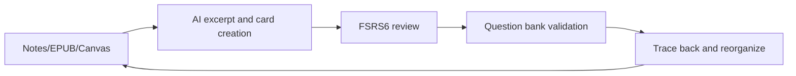

# Weave

语言： [English](README.md) | 简体中文

<div align="center">

**在 Obsidian 中完成“摘录 -> 制卡 -> 复习 -> 测试”的完整学习闭环**

</div>

Weave 是一款面向 Obsidian 的学习工作流插件。它可以把知识库中的阅读笔记和摘录内容转化为结构化学习卡片，让你按照节奏复习、用测试检验掌握程度，并随时回溯到原始来源。

自 `0.8.0` 起，EPUB 阅读器和增量阅读方向已经拆分为独立插件。当前 Weave 主插件聚焦于记忆牌组、题库、智能制卡和多来源溯源能力。

最低支持版本：Obsidian `1.7.0`


---

## 我们解决的核心问题

| 痛点 | Weave 的解决方式 |
|------|------------------|
| 笔记很多，但真正记住的不多 | 在库内制卡，结合 **FSRS6 间隔复习** |
| 记忆卡片混进原始笔记，污染结构 | 卡片进入专属卡片库，源 Markdown 保持干净 |
| 卡片和原始上下文脱节 | 通过来源锚点可回跳、定位并高亮原文 |
| 只有死记硬背，没有真实掌握检验 | 记忆牌组和题库支持分层学习与验证 |
| 手动制卡太慢 | 内置 AI 助手和批量解析流程 |
| 牌组越来越难整理 | 支持引用式、正式型和涌现型牌组组织方式 |

---

## 多来源溯源

### 分离存储，关联来源

记忆卡片适合采用最小信息表达形式，比如问答、挖空和选择题。这种格式适合复习，但不适合直接嵌入源笔记，否则容易打乱笔记结构，也会把“阅读内容”和“记忆内容”混在一起。

Weave 采用分离存储并保留来源关联：

- **源文档**：Markdown、EPUB 和 Canvas 继续作为阅读和思考空间存在
- **学习卡片**：摘录笔记和记忆卡片统一进入专属 `weave/` 卡片库
- **双向溯源**：卡片保存来源锚点，便于随时跳回上下文，来源材料也可以保持与卡片的连接

### 支持的来源类型

| 来源 | 锚点方式 |
|------|----------|
| Obsidian Markdown | 块引用和 `^block-id` |
| EPUB 阅读器插件 | CFI 加摘录锚点 |
| Canvas | Canvas 路径加节点 ID |

---


## 记忆牌组：两类卡片

记忆牌组是 Weave 中间隔复习的核心：

| 类型 | 阶段 | 作用 |
|------|------|------|
| 回顾型摘录笔记 | 阅读与理解阶段 | 保留原文片段和批注，让复习时还能恢复原始语境 |
| 回忆型记忆卡片 | 提取练习阶段 | 采用问答、挖空和选择题形式，并由 **FSRS6** 安排复习间隔 |

这两类卡片都不会写回源文档。你可以先做摘录，再逐步提升为记忆卡片，同时保留完整溯源关系。若要做更客观的掌握验证，还可以用题库从记忆卡片生成测试。

### 牌组概念

- **正式牌组**：围绕明确学习目标建立的聚焦牌组
- **涌现牌组**：从知识网络中自然浮现主题的牌组
- **引用式牌组**：在不强制固定归属的前提下灵活重组已有卡片

---

## 标准工作流



1. **输入**：从 Markdown、EPUB 或其他支持来源中做摘录
2. **组织**：用正式牌组承载目标，用涌现牌组承载发现出的主题
3. **复习**：结合摘录语境和 FSRS6 记忆卡片进行复习
4. **验证**：通过题库会话检验真实理解程度
5. **反思**：回溯来源、修正笔记、重组牌组

---

## 插件生态分工

| 插件 | 责任 |
|------|------|
| **Weave 主插件** | 记忆牌组、题库、智能制卡、溯源、AI 助手和跨插件协作 |
| **EPUB 阅读器插件** | 专注 EPUB 阅读，并支持摘录制卡和原文跳转 |
| **增量阅读插件** | 阅读队列管理和增量调度 |

---

## 免费版与高级版

图例：

- `免费版可用`
- `仅高级版`
- `免费版受限`

| 功能 | 免费版 | 高级版 | 说明 |
|------|--------|--------|------|
| 主界面、FSRS6 复习和两类卡片 | 免费版可用 | 高级版可用 | 核心记忆流程保持免费 |
| 完整溯源和查看原文 | 免费版可用 | 高级版可用 | 无许可证门槛 |
| AI 助手、批量解析、CSV 导入 | 免费版可用 | 高级版可用 | API 费用由用户自行承担 |
| 表格视图 | 免费版可用 | 高级版可用 | 基础管理视图完整可用 |
| 网格、看板、时间线 | 免费版受限 | 高级版可用 | 免费版仅保留降级体验 |
| 题库、模拟测试、牌组分析 | 仅高级版 | 高级版可用 | 面向验证和分析的能力 |
| 图片遮罩和渐进式挖空 | 仅高级版 | 高级版可用 | 更高级的学习卡片类型 |

高级版通过激活码和邮箱绑定启用。插件不包含广告，也不强制订阅。

---

## 安装

大多数用户只需要以下三个文件：

- `main.js`
- `manifest.json`
- `styles.css`

如果你需要 `Legacy APKG import`，还需要额外放入 `sql-wasm.wasm`。

### 社区插件安装

1. 打开 Obsidian 设置
2. 进入 Community plugins
3. 关闭 Restricted mode
4. 搜索 `Weave`
5. 安装并启用

### 手动安装

1. 下载：
   - `main.js`
   - `manifest.json`
   - `styles.css`
2. 如果需要 `Legacy APKG import`，再下载：
   - `sql-wasm.wasm`
3. 把这些文件复制到：

   `.obsidian/plugins/weave/`

4. 重启 Obsidian 并启用插件

说明：

- 社区商店安装只依赖上面的三件套
- `versions.json` 是仓库兼容元数据，不是社区安装所需运行时资源

---

## 快速开始

1. 打开 Weave 视图
2. 配置数据路径、牌组行为和可选集成项
3. 从 Markdown 或 EPUB 中摘录，创建记忆卡片并开始复习

---

## 数据存储

默认情况下，学习数据保存在你的本地知识库中：

| 数据 | 路径 | 格式 |
|------|------|------|
| 记忆牌组数据 | `weave/memory/` | `.wdeck` |
| 题库数据 | `weave/question-bank/` | `.qbank` |
| 插件本地状态、缓存和日志 | `.obsidian/plugins/weave/` | 插件自管文件 |

除非你明确知道影响，否则不要批量重命名或手动删除 `.wdeck` 和 `.qbank` 文件。

---

## 信息披露

### 价格

- 核心记忆和复习能力可免费使用
- 部分高级功能需要有效的付费激活码
- 高级版激活需要邮箱绑定以完成许可证校验

### 网络使用

- **AI 助手** 只会连接用户自己配置的 AI API 接口
- **许可证激活与校验** 会连接插件许可证服务
- **AnkiConnect** 只会通过 `localhost` 连接本地 Anki

### 文件访问

- 插件会读取和写入当前知识库中的 Markdown、附件、卡片数据和学习状态
- 插件本地缓存、运行时状态、备份和日志保存在 `.obsidian/plugins/weave/`
- 除非用户主动使用联网功能，否则知识库内容不会上传到外部服务

### Vault 枚举与扫描

- 某些功能会通过 Obsidian API 枚举 Markdown 文件或整个 vault 文件，例如建议弹窗、来源溯源、清理工具、重复检测和批量解析流程
- 这些扫描默认只发生在本地知识库中，除非用户主动触发另一个联网功能

### 剪贴板访问

- 剪贴板读写仅用于用户主动触发的操作，例如复制按钮、来源复制、激活码复制、提示词复制或粘贴/导入流程
- 插件不会在后台持续监控系统剪贴板

### 本地状态存储

- Weave 主要把受管理的本地状态存储在 `.obsidian/plugins/weave/` 下
- 某些历史浏览器 `localStorage` 键仍可能在兼容迁移或兜底逻辑中被读取

### 广告、遥测与源代码

- 插件不包含广告
- 插件不包含产品分析遥测
- 当前仓库包含用于审核和发布的客户端源代码，不包含私钥和服务端密钥

---

## 许可证与支持

本项目基于 [GPL-3.0-or-later](LICENSE) 发布。

- 问题反馈与功能建议：https://github.com/zhuzhige123/obsidian---Weave/issues
- 授权或商务联系：tutaoyuan8@outlook.com

---

## 开发

环境要求：Node.js 16+ 和 npm

```bash
npm install
npm run dev
npm run build
```

---

## 更多文档

- 发布说明：`docs/RELEASE_GUIDE.md`
- 图片遮罩指南：`docs/IMAGE_MASK_GUIDE.md`
